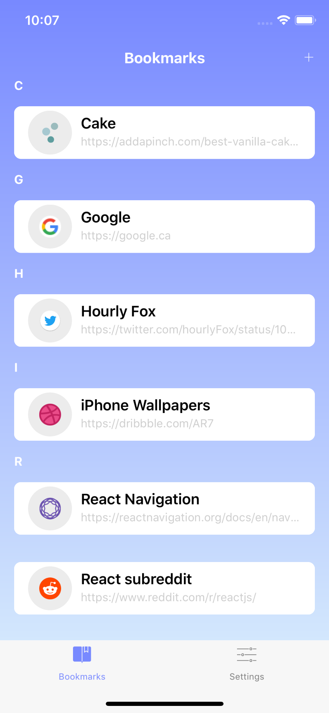
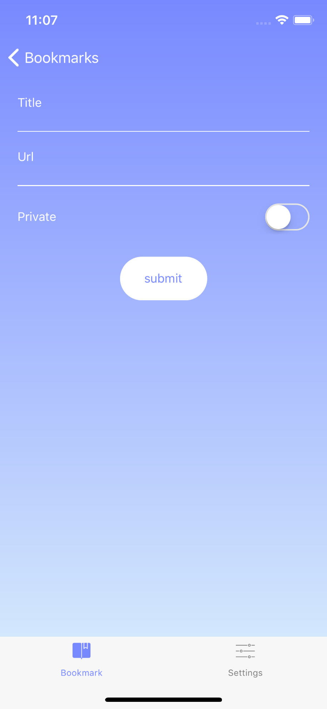

# Tabbed

Tabbed is a React Native powered app meant for storing and syncing your bookmarks across your browsers. I built this with the purpose of not having to tie my bookmarks up with a browser, since I tend to switch between Chrome, Firefox and Safari quite often.

I plan on having the app for mobile browsing, and a browser extension/companion so you don't have to export/import everytime you swap between a browser. It will simply just be installing the addon.

## Contributions

I would love contributions! Right now I'm mainly looking for help with stuff in the _TODO_ list below. Mainly the _UI_ stuff.

When commiting, please try your best to use [this](http://karma-runner.github.io/2.0/dev/git-commit-msg.html) format for your commit messages.

## TODO

### UI

* Dark mode
* Searching / Sorting
* Check if we're following Apple's guidelines

### Core

* Sync bookmarks
  * Browser extensions
  * Backend
* Ability to add bookmark
  * implement categories/folders
* Search for bookmarks (currently implemented, though [this](https://github.com/facebook/react-native/issues/4845) issue is a problem.)

### Pages

* Settings
* Onboarding

### Project

* Upgrade to Typescript?
* 100% styled components (close)

## Libraries

* Using [Realm](https://realm.io/docs/javascript/latest/) for storage
* [react-native-touch-id](https://github.com/naoufal/react-native-touch-id) for biometrics (unlocking via FaceID/TouchID)
* Using [Pose](https://popmotion.io/pose/) for animations
* [React Navigation](https://github.com/react-navigation) for navigation/tab bar
* Using [Formik](https://github.com/jaredpalmer/formik) for forms

## Screenshots

### I know it doesn't look amazing, please feel free to open an issue with design suggestions <3

